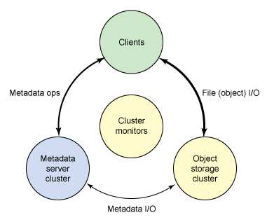
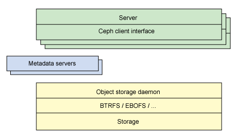
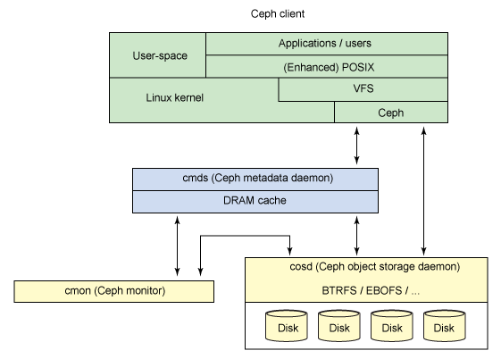
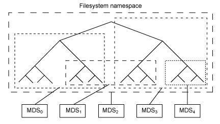
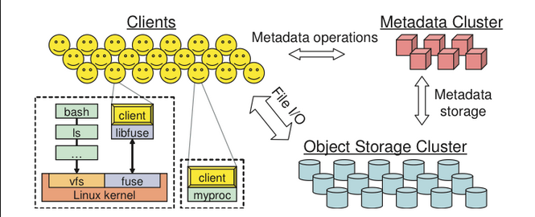
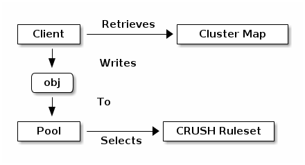
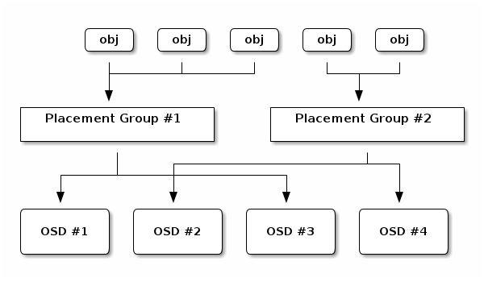

# Ceph
Ceph 提供了``` Ceph 物件儲存```以及```Ceph 區塊裝置```，除此之外 Ceph 也提供了自身的```Ceph 檔案系統```，所有的 Ceph 儲存叢集的部署都開始於 Ceph 各節點，透過網路與 Ceph 的叢集溝通。最簡單的 Ceph 儲存叢集至少要建立一個 Monitor 與兩個 OSD（Object storage daemon），但是當需要運行 Ceph 檔案系統時，就需要再加入Metadata伺服器。


# Ceph 目標
開發檔案系統是一種複雜的投入，但是如果能夠準確地解決問題的話，則擁有著不可估量的價值。我們可以把 Ceph 的目標可以簡單定義為以下：

* **容易擴充到 [PB 級別](http://en.wikipedia.org/wiki/Petabyte)的儲存容量**
* **在不同負載情況下的高效能（每秒輸入/輸出操作數[IPOS]、帶寬）**
* **高可靠性**

但這些目標彼此間相互矛盾(例如:可擴充性會減少或阻礙效能，或影響可靠性)。 Ceph 開發了一些有趣的概念(例如**動態 metadata 分區**、**資料分散**、**複製**)。

Ceph 的設計也集成了**容錯性**來防止**單一節點故障問題（SOPF）**，並假設，大規模 （PB 級）中儲存的故障是一種常態，而非異常。最後，它的設計沒有假設特定的工作負荷，而是包含了可變的分散式工作負荷的適應能力，從而提供最佳的效能。它以[POSIX](http://zh.wikipedia.org/wiki/POSIX) 兼容為目標完成這些工作，允許它透明的部署於那些依賴於 POSIX 語義上現有的應用(通過Ceph增強功能)。最後，Ceph 是開源分散式儲存和 Linux 主流核心的一部分。


其中最底層的 RADOS 是由 OSD、Monitor 與 MDS 三種所組成。

# Ceph 架構
現在，讓我們先在上層探討 Ceph 架構及其核心元素。之後深入到其它層次，來解析 Ceph 的一些主要方面，從而進行更詳細的分析。

Ceph 生態系統可以大致劃分為四部分（圖1）：
* **客戶端** (資料使用者)
* **metadata 伺服器** (快取及同步分散的metadata)
* **物件儲存叢集** (以物件方式儲存資料與 metadata，實現其它主要職責)
* **叢集監控** (實現監控功能)



如圖所示，客戶使用 metadata 伺服器，執行 metadata 操作(來確定資料位置)。metadata 伺服器管理資料位置，以及在何處儲存取新資料。值得注意的是，metadata 儲存在一個儲存叢集上（標記為 "metadata I/O"）。實際的檔案 I/O 發生在客戶和物件儲存叢集之間。這樣一來，提供了更高層次的 POSIX 功能(例如，開啟、關閉、重新命名)就由 metadata 伺服器管理，不過 POSIX 功能（例如讀和寫）則直接由物件儲存叢集管理。



上面分層視圖說明了，一系列伺服器透過一個客戶端介面存取 Ceph 生態圈系統，這就明白了 metadata 伺服器和物件級儲存之間的關係。分散式儲存系統可以在一些層面中查看，包括一個儲存設備的格式（Extent and B-tree-based Object File System [EBOFS]或者一個備選），還有一個設計用於管理資料複製、故障檢測、復原，以及隨後資料遷移的覆蓋管理層，叫做```Reliable Autonomic Distributed Object Storage（RADOS）```。最後，監視器用於區別元件中的故障，包括隨後的通知。

# Ceph 元件成員
### 簡單的 Ceph 生態系統
了解 Ceph 概念架構後，我們來探討另一個層次，了解在 Ceph 中實現的主要元件。 Ceph 和傳統檔案系統之間的重要差異之一，就是智能部分都用在了生態環境，而不是檔案系統本身。


圖中顯示了一個簡單的Ceph生態系統。Ceph Client 是 Ceph 檔案系統的用戶。Ceph Metadata Daemon 提供了 metadata 伺服器，而 Ceph Object Storage Daemon 提供了實際儲存（對資料和 metadata 兩者）。最後 Ceph Monitor 提供了叢集管理。要注意的是 Ceph 客戶，物件儲存端點，metadata 伺服器（根據檔案系統的容量）可以有許多，而且至少有一對冗餘的監視器。那麼這個檔案系統是如何分散的呢？

### Ceph Client
因為Linux顯示檔案系統的一個共有介面（通過虛擬檔案系統交換機[VFS]），Ceph 的用戶透視圖就是透明的。然而管理者的透視圖肯定是不同的，考慮到很多伺服器會包含儲存系統這一潛在因素（要查看更多建立的 Ceph 叢集的資訊，可看參考資料部分）。從用戶的角度來看，存取大容量的儲存系統，卻不知道下面聚合成一個大容量的**儲存池**的 metadata 伺服器、監視器、還有獨立的對象儲存裝置。用戶只是簡單地看到一個安裝點，在這點上可以執行標准檔案 I/O。

> P.S **核心或使用者空間** : 早期版本的 Ceph 利用在 User SpacE（FUSE）的 Filesystems，它把文件系統推入到用戶空間，還可以很大程度上簡化其開發。但是今天，Ceph 已經被集成到主線內核，使其更快速，因為用戶空間上下文交換機對文件系統 I/O 已經不再需要。


### Ceph Metadata Server（MDS）
作為處理 Ceph File System 的 metadata 之用，若僅使用 Block or Object storage，就不會用到這部分功能。



> **P.S 若只使用 Ceph Object Storage 與 Ceph Block Device 的話，將不需要部署 MDS 節點。**

### Ceph Monitor（MON）
Ceph 包含實施叢集映射管理的監控者，但是故障管理的一些要素是在物件儲存本身執行的。當物件儲存裝置發生故障或者新裝置加入時，監控者就會檢測和維護一個有效的叢集映射。這個功能會按一種分散式的方法執行，這種方式中映射升級可以和當前的流量溝通。Ceph 使用[Paxos](http://zh.wikipedia.org/zh-tw/Paxos%E7%AE%97%E6%B3%95)，它是一系列分散式共識演算法。

在每一個 Ceph 儲存中，都有一到多個 Monitor 存在，為了有效的在分散式的環境下存取檔案，每一個 Ceph Monitor daemon 維護著很多份與 叢集相關的映射資料(map)，包含：
* **Monitor map**：包含叢集的 fsid 、位置、名稱、IP 位址和 Port，也包括目前 epoch、此狀態圖何時建立與最近修改時間。
* **OSD map**：包含叢集 fsid 、此狀態圖何時建立、最近修改時間、儲存池（Pools）列表 、副本數量、放置群組（PG）數量、 OSD 列表與其狀態（如 up 、 in ）
* **Placement Group map**：包含放置群組版本、其時間戳記、最新的 OSD epoch、佔用率以及各放置群組詳細，如放置群組 ID 、 up set 、 acting set 、 PG 狀態（如 active+clean），和各儲存池的資料使用情況統計。
* **CRUSH map**： 包含儲存裝置列表、故障域樹狀結構（如裝置、主機、機架、row、機房等等），以及儲存資料時如何利用此樹狀結構的規則。
* **MDS map**：包含當前 MDS map 的 epoch、建立於何時與最近修改時間，還包含了儲存 metadata 的儲存池、metadata 伺服器列表、還有哪些 metadata 伺服器是 ```up``` 且```in``` 的。

主要是用來監控 Ceph 儲存叢集上的即時狀態，確保 Ceph 可以運作無誤。

### Ceph Object Storage Daemon（OSD）
與傳統的物件儲存類似，Ceph 儲存節點不僅包括儲存，還包含了智能容錯與恢復。傳統的驅動是只響應來自啟動者下達的命令中簡單目標。但是物件儲存裝置是智能裝置，它能作為目標和啟動者，支持與其他物件儲存裝置的溝通與合作。

實際與 Client 溝通進行資料存取的即為 OSD。每個 object 被儲存到多個 PG（Placement Group）中，每個 PG 再被存放到多個 OSD 中。為了達到 Active + Clean 的狀態，確認每份資料都有兩份的儲存，每個 Ceph 儲存叢集中至少都必須要有兩個 OSD。

主要功能為實際資料（object）的儲存，處理資料複製、恢復、回填（backfilling, 通常發生於新 OSD 加入時）與重新平衡（發生於新 OSD 加入 CRUSH map 時），並向 Monitor 提供鄰近 OSD 的心跳檢查資訊。



### CRUSH
Ceph 透過 CRUSH（Controlled, Scalable, Decentralized Placement of Replicated Data） 演算法來計算資料儲存位置，來確認如何儲存和檢索資料，CRUSH 授權 Ceph client 可以直接連接 OSD，而不再是透過集中式伺服器或者中介者來儲存與讀取資料。該演算法與架構特性使 Ceph 可以避免單一節點故障問題、效能瓶頸與擴展的限制。

CRUSH 是一種偽隨機資料分散算法，能夠再階層結構的儲存叢集很好地分散物件的副本，該演算法實作了偽隨機(確定性)的函式，會透過輸入o​​bject id、object group id等參數，來回傳一組儲存裝置（即儲存物件的副本）。CRUSH 有以下兩個重要的資訊：
* **Cluster Map**：被用來描述儲存叢集的階層結構。
* **CRUSH Rule**：被用來描述副本的分散策略。

CRUSH 主要提供了以下功能：
* 將資料有效率的存放在不同的儲存裝置中。
* 即使移除整個 cluster中的儲存裝置，也不會影響到資料正常的存取。
* 不需要有任何主要的管理裝置(or 節點)來做為控管之用。
* 可依照使用者所定義的規則來處理資料分散的方式。

透過以上資訊，CRUSH 可以將資料分散存放在不同的儲存實體位置，並避免單點錯誤造成資料無法存取的狀況發生。

### Pools
Pool 是儲存物件邏輯分區。Ceph Client 從 Monitor 取得 Cluster map，並把物件寫入 Pool。Pool 的副本數、CRUSH Ruleset 和 PG 數量決定著 Ceph 該如何放置資料。



一個 Pool 可以設定許多參數，但最少需要正確設定以下資訊：
* 物件擁有權與存取權限
* Placement Group 數量
* CRUSH Ruleset 設定與使用

### Placement Group
Ceph 把物件映射到放置群組（PG），PG 是一種邏輯的物件 Pool 片段，這些物件會組成一個群組後，再存到 OSD 中。PG 減少了各物件存入對應的 OSD 時 metadata 的數量，更多的 PG（如：每個OSD 有 100 個群組）可以使```負載平衡```更好。



> **P.S 多個 PG 也可以對應到同一個 OSD，因此 PG 與 OSD 其實是種多對多的關係。**

#### PG ID 計算
當 Client 在綁定某個 Monitor 時，會先取得最新的 Cluster map 副本，該 map 可讓 Client 端知道叢集有多少 Monitor、OSD 與 MDS。但是無法知道要存取的物件位置。

在 Ceph 中，物件的位置是透過計算得知的。因此 Client 只需要傳入 Object id 與 Pool 即可知道物件位置。當 Client 需要有名稱物件（如 mysql、archive 等）時，Ceph 會用物件名稱來計算 PG（是一個 Hash value）、 OSD 編號與 Pool。流程如下：
* Client 輸入 pool id 與 object id（e.g., pool='vms', object id='instance-1'）
* CRUSH 取得 object id，並進行 Hash 取得值
* CRUSH 在以 OSD 數量對 Hash value 進行 mod 運算，來取得 pg id（e.g., 58）
* CRUSH 再透過取得 pool name 來取得 pool id（e.g., 'vms' = '4'）
5* CRUSH 在把 pool id 加到 pg id 前面（e.g, 4.58）

透過計算物件位置的方式，改善了傳統查詢定位的效能問題。CRUSH 演算法讓 Client 計算物件應該存放到哪裡，並連接該 Primary OSD 進行物件儲存與檢索。

# Ceph 三大儲存服務系統特性與功能
Ceph  是一個統一的儲存系統，提供了物件、區塊與檔案系統功能，且擁有高可靠、高擴展。該三大儲存服務功能與特性如下：

| CEPH 物件儲存 | CEPH 區塊裝置 | CEPH 檔案系統 |
|-------------|----------|--------------|
|RESTful 介面|精簡空間配置|與 POSIX 語意相容|
|與 S3 和 Swift 相容的 API|映像檔大小最大支援 16 EB（exabytes）|Metadata 與資料分離|
|S3 風格的子域名|可組態的等量化（Configurable striping）|動態重新平衡(Dynamic rebalancing)|
|統一的 S3/Swift 命名空間|記憶體快取|子目錄快照|
|使用者管理|快照|可組態的等量化（Configurable striping）|
|利用率追蹤|寫入時複製 cloning|核心驅動的支援|
|等量化物件（Striped objects）|支援 KVM 與 libvirt|支援使用者空間檔案系統（FUSE）|
|雲端解決方案整合|可作為雲端解決方案的後端|可作為 NFS/CIFS 部署|
|多站點部署|累積備份|可用於 Hadoop 上（替代 HDFS ）|
|災難復原|

## 參考
* [Ceph中文文件](http://mirrors.myccdn.info/ceph/doc/docs_zh/output/html/)
* [小信豬 Ceph](http://godleon.blogspot.tw/2014/10/ceph.html)
* [Ceph 官方文件](http://ceph.com/docs/master/)
* [Ceph Development](http://ceph.com/resources/development/)
* [Ceph 整合案例](http://cloud.51cto.com/art/201504/470780_all.htm)
* [Ceph Book](https://books.google.com.tw/books?hl=zh-TW&lr&id=HftzBgAAQBAJ&oi=fnd&pg=PP1&dq=openstack%20ceph&ots=OWwptmw5Mm&sig=d1uC5NThemjRudfktDXmuQ6TqA0&redir_esc=y#v=onepage&q=openstack%20ceph&f=false)
