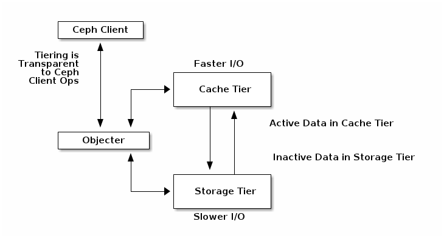

# Cache Tiering （分層快取）
Cache Tiering 提供了Ceph Client與儲存在後台儲存層的資料子集，可以有更好的```I/O效能```。
Cache tiering需要透過一個```高速/昂貴```的儲存裝置（SSD）組成的```Pool```當作```cache tier```，以及一個```低速/廉價```的儲存裝置（HDD）組成的```Pool（或者是Erasure Coded）```當作```economical storage tier```。

```Ceph objecter```處理物件該往哪裡儲存，```Tiering agent```則處理何時從```cache```中，將物件flush到後台儲存層。所以```cache tier```與```backing storage tier```對Ceph Client來說是完全透明的。


Cache tiering agent自動處理```cache tier```與```backing storage tier```之間的資料搬移。但是管理可以設置這些```搬移規則``，主要有兩種情況：
* **Writeback Mode**：當管理員把```cache tier```設置為``` writeback mode```時，Ceph Client會資料寫入cache tier並接收來自cache tier發送的ACK。隨著時間的推移，寫入到cache tier中的資料會搬移到storage tier並從cache tier刷新掉。從概念上來說cache tier位於backing storage tier的前面。當Ceph Client需要要讀取位於storage tier的資料時，cache tiering agent會把這些資料搬移到cache tier，然後再送往Ceph Client。此後，Ceph Client將與caceh tier進行I/O操作，直到資料不再被讀寫。此模式對於```易變資料（熱資料）```來說較為理想（如照片/視訊串流、事物資料等）。

* **Read-only Mode**：當管理員把```cache tier```設置為``` read-only mode```時，Ceph會直接把資料寫入後端。讀取時，Ceph會把對應的物件從backing tier複製到cache tier以根據定義的策略將物件從cache tier移出。此模式適合```不變的資料（冷資料）```，如社交網路上顯示的圖片與視訊、DNA資料、X-Ray照片等，因為cache tier讀出的資料可能包含過期的資料，因此一致性較差。對```易變資料```不要用```read only```模式。

因為所有的Ceph Client都能用cache tier，所以才能提升```區塊設備```、```物件儲存```、```Ceph檔案系統```與原生的I/O效能的潛力。

## 設置儲存池 Pools
要設定cache tier，必須要有```兩個Pool```。一個作為backing storage，另一個作為設定cache tier。

#### Backing Storage Pool
設定後端儲存Pool通常會遇到兩種情況：
* **Standard storage**：此時，Ceph儲存叢集內的儲存Pool，會保存了一個物件的多個副本。
* **Erasure coding**：此時，儲存Pool用Erasure coding更有效地儲存資料，但效能會稍有損失。

在```Standard storage```情況中，你可以設置來```CRUSH```規則集合設立```failure domain```（諸如：osd、host、chassis、rack、 row...etc.）。當規則集合，涉及的所有驅動規格、速度（轉速與吞吐量）與類型相同時，OSD Deamon會執行的最佳。建立CRUSH規則集合的細節可以參考[CURSH Map](http://docs.ceph.com/docs/master/rados/operations/crush-map/)。建立好CRUSH 規則集合後，再建立backing storage pool。

在Erasure coding情況中，建立儲存Pool時，指定好參數就會自動生成合適的規則集合，細節可參考[建立儲存Pool](http://docs.ceph.com/docs/master/rados/operations/pools/#create-a-pool)。在後續例子，我們會把```cold-storage```當作backing storage pool。

#### Cache Pool
Cache pool的設定步驟大致與Standard storage差不多，在不同的部分為cache tier所使用的驅動通常都是高效能的，且安裝在專用伺服器上，有自己的規則集合。制定規則集合時，需要考慮到裝有高效能驅動的電腦，並忽略沒有的電腦。詳細可參考[儲存Pool指定OSD](http://ceph.com/docs/master/rados/operations/crush-map/#placing-different-pools-on-different-osds)

在後續範例中，```hot-storage```會作為cache Pool，```cold-storage```會作為backing storage Pool。

關於Cache tier的設定以及預設值的詳細解釋，可以參考儲存Pool-[調整儲存Pool](http://docs.ceph.com/docs/master/rados/operations/pools/#set-pool-values)。
## Creating a cache tier
設定一個cache tier需要把```cache pool```串接到```backing storage pool```上：
```
ceph osd tier add {storagepool} {cachepool}
```
ex：
```
ceph osd tier add cold-storage hot-storage
```
之後用指令設定cache tiering mode：
```
ceph osd tier cache-mode {cachepool} {cache-mode}
```
ex：
```
ceph osd tier cache-mode hot-storage writeback
```

Cache Tiers覆蓋於backing storage tier之上，所以我們要多設定一個步驟，必須把所有Client的流量從Pool搬移到cache pool。使用以下指令將Client流量指向cache pool：
```
ceph osd tier set-overlay {storagepool} {cachepool}
```
ex：
```
ceph osd tier set-overlay cold-storage hot-storage
```

## Configuring a cache tier
Cache tier支援了幾個設定選項，可按下列指令設定：
```
ceph osd pool set {cachepool} {key} {value}
```
> 詳細參考[Pool—調整Pool](http://docs.ceph.com/docs/master/rados/operations/pools/#set-pool-values)。

#### TARGET SIZE AND TYPE
在Ceph生產環境下Cache tier的```hit_set_type```參數使用了 [Bloom Filter](https://en.wikipedia.org/wiki/Bloom_filter)：
```sh
ceph osd pool set hot-storage hit_set_type bloom
```
```hit_set_count```與```hit_set_period```選項，可控制各種 HitSet 計算的時間區間，以及保留多少個這樣的 HitSet。目前```hit_set_count > 1```有微小的優勢，由於agent還沒不能處理複雜的訊息
```sh
ceph osd pool set {cachepool} hit_set_count 1
ceph osd pool set {cachepool} hit_set_period 3600
ceph osd pool set {cachepool} target_max_bytes 1000000000000
```
分級存取隨著時間允許Ceph，來確認一個Ceph Client在一段時間內存取了謀個物件一次或多次（壽命與熱度）。
> 注意！當統計時間越長、數量越多，```ceph-osd```
統計時間越長、數量越多，ceph-osd進程消耗的內存就越多，特別是代理正忙著刷回或趕出對象時，此時所有hit_set_count個HitSet都要載入內存。

#### CACHE SIZING
Cache tiering agent 主要有兩個功能：
* **Flushing**：Agent會識別修改過（或者變質）的物件，並把它們轉發給儲存Pool作為長期的cache。
* **Evicting**：Agent會識別未修改過（或者乾淨）的物件，並把未用過的物件移出cache。

#### RELATIVE SIZING
Cache tiering agent 能夠根據cache儲存pool的相對大小對物件進行flush或者evict。當cache pool包含了已修改（或者變質）物件達到一個比例時，cache tier agent就把它們flush到儲存pool。可以用以下指令設定比例```cache_target_dirty_ratio```：
```sh
ceph osd pool set {cachepool} cache_target_dirty_ratio {0.0..1.0}
```
一個dirty物件達到```40%```的範例：
```sh
ceph osd pool set hot-storage cache_target_dirty_ratio 0.4
```
當dirty物件到達一定比例的容量時，在flush dirty物件時會比較快的速度，可以透過以下指令設定```cache_target_dirty_high_ratio```：
```sh
ceph osd pool set {cachepool} cache_target_dirty_high_ratio {0.0..1.0}
```
一個當比例達到```60%```時，將開始flush dirty物件的範例：
```sh
ceph osd pool set hot-storage cache_target_dirty_high_ratio 0.6
```
當cache pool利用率達到總容量一定比例時，cache tiering agent將移出部分物件來維持足過的空間，可以用以下指令來設定```cache_target_full_ratio```：
```sh
ceph osd pool set {cachepool} cache_target_full_ratio {0.0..1.0}
```
一個當總容量達到```80%```時，將clean物件移出的範例：
```sh
ceph osd pool set hot-storage cache_target_full_ratio 0.8
```

#### ABSOLUTE SIZING
Cache tiering agent 能根據總bytes或者物件的數量來flush或者evict物件，可以使用下列指令指定最大的bytes：
```sh
ceph osd pool set {cachepool} target_max_bytes {#bytes}
```
設定一個達到1TB時，flush or evict物件：
```sh
ceph osd pool hot-storage target_max_bytes 1000000000000
```
以下指令可以指定 cache 物件的最大數量：
```sh
ceph osd pool set {cachepool} target_max_objects {#objects}
```
設定一個當物件達到1M時，開始flush與evict物件：
```sh
ceph osd pool set hot-storage target_max_objects 1000000
```
> 如果兩個都有設定，cache tiering agent 會按照先到的```門檻值```優先執行flush與evict。

#### CACHE AGE
可以規範cache tiering agent必須延遲多久時間，才能把謀個已修改（變質）的物件flush回到 backing storage pool：
```sh
ceph osd pool set {cachepool} cache_min_flush_age {#seconds}
```
好比讓一個已修改（變質）物件延遲10分鐘才flush：
```sh
ceph osd pool set hot-storage cache_min_flush_age 600
```
也可以指定某物件，在cache tier放置多長時間才會被evict：
```sh
ceph osd pool {cache-tier} cache_min_evict_age {#seconds}
```
好比設定30分鐘後，evict物件：
```sh
ceph osd pool set hot-storage cache_min_evict_age 1800
```

## REMOVING A CACHE TIER
刪除writeback以及read-only模式的cache tier過程並不同：
#### REMOVING A READ-ONLY CACHE
read-only沒有改變的資料，所以停用不會導致任何資料的遺失，首先把cache tier mode改為```none```，來停用：
```sh
ceph osd tier cache-mode {cachepool} none
```
ex:
```sh
ceph osd tier cache-mode hot-storage none
```
然後刪除 backing pool的cache pool：
```sh
ceph osd tier remove {storagepool} {cachepool}
```
ex:
```sh
ceph osd tier remove cold-storage hot-storage
```
#### REMOVING A WRITEBACK CACHE
writeback模式可能包含變更的資料，所以在停用並刪除前，必須採取一些方式，以免遺失cache內最近改變的資料，首先把cache模式改成```forward```，這樣新的與更改過的物件，將直接flush到backing storage pool：
```sh
ceph osd tier cache-mode {cachepool} forward
```
ex：
```sh
ceph osd tier cache-mode hot-storage forward
```
透過```rados```確認cache pool已flush，這邊會等待一點時間：
```sh
rados -p {cachepool} ls
```
如果cache pool裡面還有物件，可以透過手動來flush：
```sh
rados -p {cachepool} cache-flush-evict-all
```
移除此overlay，使客戶端不再在被指到cache中：
```sh
ceph osd tier remove-overlay {storagetier}
```
ex：
```sh
ceph osd tier remove-overlay cold-storage
```
最後，從 backing pool 中刪除 cache pool：
```sh
ceph osd tier remove {storagepool} {cachepool}
```
ex：
```sh
ceph osd tier remove cold-storage hot-storage
```
