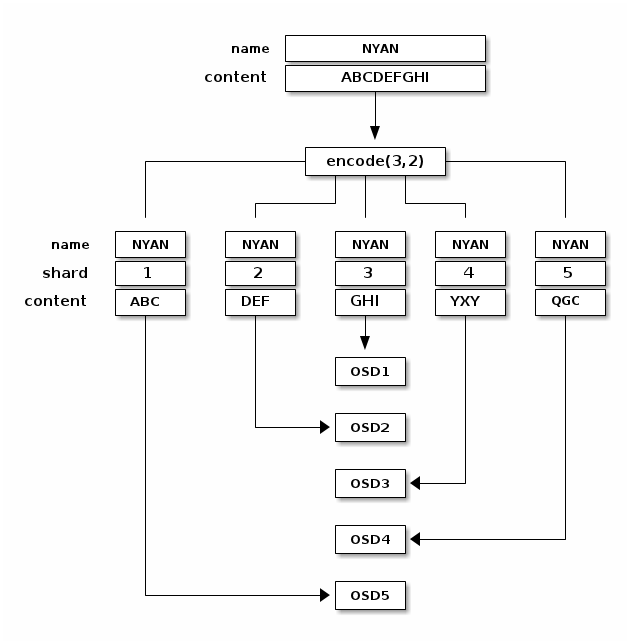

# Erasure Code（抹除碼）
Ceph pool 是關聯一種支援OSD損失的（因為在大部份情況下每一個disk都有一個OSD）。在[建立 pool](http://docs.ceph.com/docs/master/rados/operations/pools/)時，預設會選擇副本，這意味著每個物件會複製到多個 OSD 上。[Erasure code](https://en.wikipedia.org/wiki/Erasure_code) pool類型可用來代替以節省空間。

## Creating a sample erasure coded pool
一個最簡單的Erasure coded pool相當於 [RAID 5](https://en.wikipedia.org/wiki/Standard_RAID_levels#RAID_5)， 我們至少需要三台電腦：
```sh
ceph osd pool create ecpool 12 12 erasure
# pool 'ecpool' created
echo ABCDEFGHI | rados --pool ecpool put NYAN -
rados --pool ecpool get NYAN -
# ABCDEFGHI
```
> ```12```是 Pool 建立表示 [Placement groups 的數量](http://docs.ceph.com/docs/master/rados/operations/pools/)。

## Erasure code profiles
預設的Erasure code profile支援了單一OSD的損失。它相當於一個複製兩個 size 的 pool，但需要 1.5TB 來取代 2TB 來儲存 1TB 的資料。可以透過以下指令顯示預設profile：
```sh
ceph osd erasure-code-profile get default
```
會顯示類似以下資訊：
```
directory=.libs
k=2
m=1
plugin=jerasure
ruleset-failure-domain=host
technique=reed_sol_van
```
選擇正確的 ```profile``` 是很重要的，因為它不能在 pool 建立後被修改。一個新的Pool若有不同的Profile需要建立時，所有物件要從以前的Pool搬移到新的Pool。

最重要的porfile的參數是 ```K```, ```M```以及 ```ruleset-failure-domain```，因為他們定義了```儲存損耗```與```資料持久性```。例如，如果期望的架構必須支持具有兩個開銷40%的儲存消耗機架的損失，可以依照以下來定義profile：
```sh
# 建立 ECP
ceph osd erasure-code-profile set myprofile k=3 m=2 ruleset-failure-domain=rack

# 建立一個自己設定的Profile
ceph osd pool create ecpool 12 12 erasure <myprofile>

# put 一個名為NYAN的物件
echo ABCDEFGHI | rados --pool ecpool put NYAN -
rados --pool ecpool get NYAN -
# ABCDEFGHI
```
```NYAN``` 物件將被切割為三個（K = 3）與兩個額外的chunks將被建立（M = 2）。M 值定義了多少個OSD能在同時損失時，也不會失去任合資料。```ruleset-failure-domain=rack ```將建立一個 CRUSH 的 ```ruleset``` 來確保在同一個機架上沒有兩個chunks。


更多的資訊能夠在[Erasure code profiles](http://docs.ceph.com/docs/master/rados/operations/erasure-code-profile/)文件找到。

## Erasure coded pool and Cache tiering
Erasure coded pools 要求比```replicated pools```更多的資源，且會缺少了一些功能，如```部分寫入```。
為了克服這些限制，建議在做 erasure coded pools之前設定 cache tiering：

例如，一個```hot-storage```的pool是一個快速的儲存，可以這樣設定：
```sh
ceph osd tier add ecpool hot-storage
ceph osd tier cache-mode hot-storage writeback
ceph osd tier set-overlay ecpool hot-storage
```
將放置```hot-storage``` pool運行於```writeback```模式，如ecpool的tier，使每個讀寫的ecpool實際上是利用```hot-storage```，且受益於其靈活性與速度。

它是不可能在一個 erasure coded pool 建立一個 RBD image，因為它需要```部分寫入```。但它可以在一個erasure coded pool建立一個replicated pool tier設定cache tier時，建立一個RDB image：
```sh
rbd --pool ecpool create --size 10 myvolume
```

更多的資訊可以在 [cache tiering](http://ceph.com/docs/master/rados/operations/cache-tiering) 文件找到。

## Glossary（術語）
* **chunk**：當encoding function被呼叫時，它會回傳相同size的塊。Data chunks 可以串連到重構的源物件與coding chunks，可用於重建遺失的chunks。
* **K**：表示Data chunks 的數量，即在原來的物件被分割的chunks數量。例如，如果有K = 2個的10KB物件，該物件將被分割為K個5KB物件。
* **M**：表示 Coding chunks的數量，即 encoding functions 計算的附加chunks的數量。如果有2個coding chunks，這意味著有2個OSD可以隨意進出，而不遺失資料。

## Table of content
* [Erasure code profiles](http://ceph.com/docs/master/rados/operations/erasure-code-profile/)
* [Jerasure erasure code plugin](http://ceph.com/docs/master/rados/operations/erasure-code-jerasure/)
* [ISA erasure code plugin](http://ceph.com/docs/master/rados/operations/erasure-code-isa/)
* [Locally repairable erasure code plugin](http://ceph.com/docs/master/rados/operations/erasure-code-lrc/)
* [SHEC erasure code plugin](http://ceph.com/docs/master/rados/operations/erasure-code-shec/)

