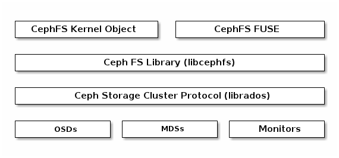

# Ceph File System
底層的部分同樣是由 RADOS(OSDs + Monitors + MDSs) 提供，在上一層同樣與 librados 溝通，最上層則是有不同的 library 將其轉換成標準的 POSIX 檔案系統供使用。



### 建立一個Ceph File System

首先將一個叢集建立完成，如4.1章節架構，並提供Metadata Server Node與Client，建立Client可以透過以下指令：
```py
ceph-deploy install <myceph-client>
```
建立MDS節點可以透過以下指令：
```py
ceph-deploy mds create mds-node
```
當Ceph 叢集已經提供了MDS後，可以建立Data Pool與Metadata Pool:
```py
ceph osd pool create cephfs_data 128
ceph osd pool create cephfs_metadata 128
```
> **How to judge PG number**
* Less than 5 OSDs set pg_num to 128
* Between 5 and 10 OSDs set pg_num to 512
* Between 10 and 50 OSDs set pg_num to 4096
* If you have more than 50 OSDs, you need to understand the tradeoffs and how to calculate the pg_num value by yourself

完成Pool建立後，我們將儲存池拿來給File System使用，並建立檔案系統：
```sh
ceph fs new cephfs cephfs_metadata cephfs_data
```
取得 Client 驗證金鑰 ：
```sh
cat /etc/ceph/ceph.client.admin.keyring
[client.admin]
	key = AQC/mo9VxqsXDBAAQ/LQtTmR+GTPs65KBsEPrw==
```
建立，並儲存到檔案```admin.secret```：
```sh
AQC/mo9VxqsXDBAAQ/LQtTmR+GTPs65KBsEPrw==
```
檢查MDS與FS：
```sh
ceph fs ls
ceph mds stat
```
建立Mount用目錄，並且Mount File System：
```sh
sudo mkdir /mnt/mycephfs
sudo mount -t ceph {ip-address-of-monitor}:6789:/ /mnt/mycephfs/ -o name=admin,secretfile=admin.secret
```
檢查系統DF與Mount結果：
```sh
sudo df -l
sudo mount
```
> * 使用CEPH檔案系統時，要注意是否安裝了元資料伺服器(Metadata Server)。且請確認CEPH版本為是```0.84```之後的版本。

### Ceph Filesystem FUSE (File System in User Space)
首先在MDS節點上安裝ceph-fuse 套件：
```sh
sudo apt-get install ceph-fuse
```
完成後，我們就可以Mount起來使用：
```sh
sudo mkdir /mnt/myceph-fuse
sudo ceph-fuse -m {ip-address-of-monitor}:6789 /mnt/myceph-fuse
# 增加驗證方式 (選擇性)
sudo ceph-fuse -k ./ceph.client.admin.keyring -m {ip-address-of-monitor}:6789 ~/mycephfs

```
當Mount成功後，就可以到該目錄檢查檔案。

> **FUSE**
> * 使用者空間檔案系統（Filesystem in Userspace，簡稱FUSE）是作業系統中的概念，指完全在使用者態實作的檔案系統。目前Linux通過內核模組對此進行支援。一些檔案系統如ZFS，glusterfs和lustre使用FUSE實作。
